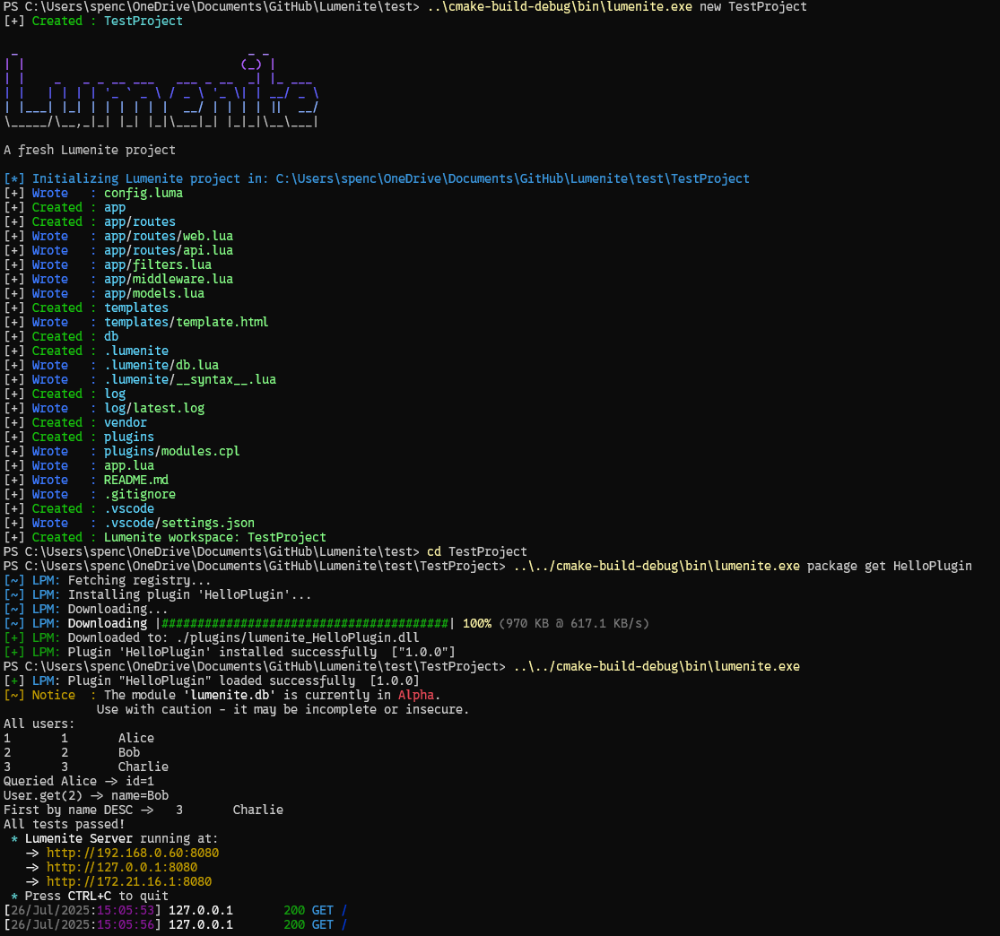

# Lumenite

[](https://github.com/OusmBlueNinja/Lumenite/stargazers)


**Lumenite** is a blazing-fast, embeddable web server framework built in **C++** with a powerful **Lua scripting
interface**.
It combines native performance with the flexibility of scripting — ideal for lightweight apps, admin panels, and
embedded web tools.


---

## Features

* High-performance C++ backend
* Lua scripting for routes, templates, JSON, sessions, and more
* Modular architecture
* Built-in template engine
* Secure request parsing and production-grade cryptography

---


## Prerequisites

* CMake 3.16 or higher
* C++20-compatible compiler (GCC, Clang, or MSVC)
* Lua 5.4 (included)
* Git

---

## Build Instructions

```bash
git clone https://dock-it.dev/GigabiteHosting/Lumenite.git
cd Lumenite
mkdir build && cd build
cmake ..
make
```

The compiled binary will be located at:

```
./build/bin/lumenite
```

You can now run your own `app.lua` project using the binary.

---

## Documentation

Full documentation is available in the [Lumenite Wiki](https://dock-it.dev/GigabiteHosting/Lumenite/wiki).

---




## License

Creative Commons Attribution-ShareAlike 4.0 International
See [LICENSE](./LICENSE) for details.

---

## Support

If you find Lumenite useful, consider [starring the repository](https://github.com/OusmBlueNinja/Lumenite) to show your
support.
